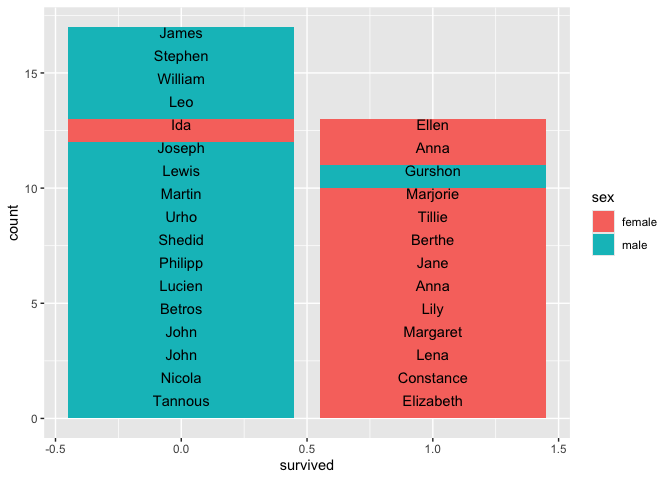
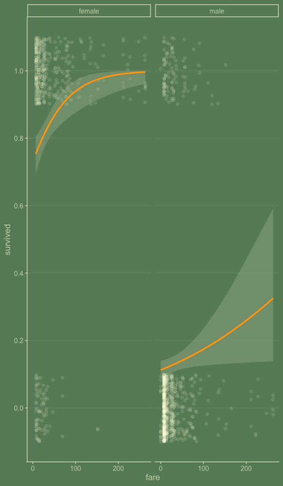
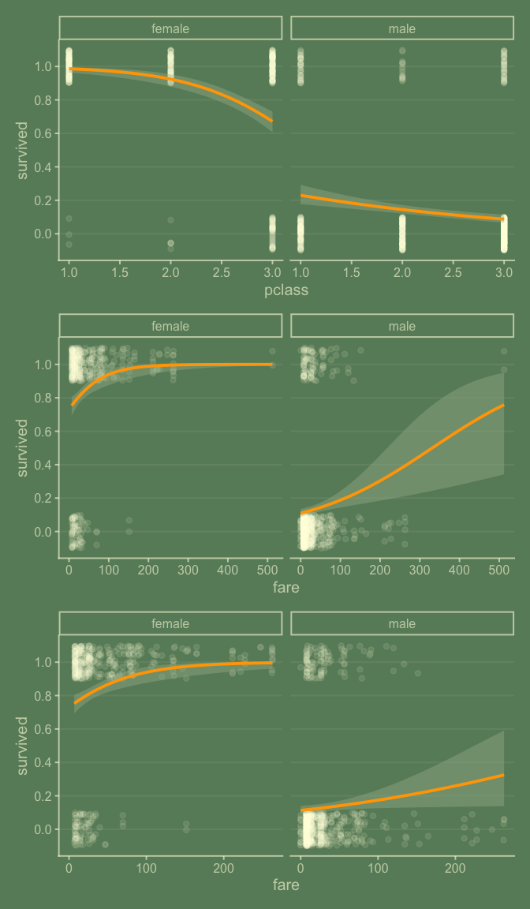

<!-- README.md is generated from README.Rmd. Please edit that file -->

# tidytitanic

<!-- badges: start -->
<!-- badges: end -->

You can install development version from [GitHub](https://github.com/)
with:

``` r
# install.packages("remotes")
remotes::install_github("EvaMaeRey/tidytitanic")
```

``` r
library(tidytitanic)
tidy_titanic |> head()
#>   id class  sex   age survived
#> 1  1   3rd Male Child       No
#> 2  2   3rd Male Child       No
#> 3  3   3rd Male Child       No
#> 4  4   3rd Male Child       No
#> 5  5   3rd Male Child       No
#> 6  6   3rd Male Child       No

flat_titanic |> head()
#>   class    sex   age survived freq
#> 1   1st   Male Child       No    0
#> 2   2nd   Male Child       No    0
#> 3   3rd   Male Child       No   35
#> 4  Crew   Male Child       No    0
#> 5   1st Female Child       No    0
#> 6   2nd Female Child       No    0

passengers |> head()
#>   passenger_id survived pclass
#> 1            1        0      3
#> 2            2        1      1
#> 3            3        1      3
#> 4            4        1      1
#> 5            5        0      3
#> 6            6        0      3
#>                                                  name    sex age sib_sp parch
#> 1                             Braund, Mr. Owen Harris   male  22      1     0
#> 2 Cumings, Mrs. John Bradley (Florence Briggs Thayer) female  38      1     0
#> 3                              Heikkinen, Miss. Laina female  26      0     0
#> 4        Futrelle, Mrs. Jacques Heath (Lily May Peel) female  35      1     0
#> 5                            Allen, Mr. William Henry   male  35      0     0
#> 6                                    Moran, Mr. James   male  NA      0     0
#>             ticket    fare cabin embarked
#> 1        A/5 21171  7.2500              S
#> 2         PC 17599 71.2833   C85        C
#> 3 STON/O2. 3101282  7.9250              S
#> 4           113803 53.1000  C123        S
#> 5           373450  8.0500              S
#> 6           330877  8.4583              Q
```

``` r
library(tidytitanic)

head(flat_titanic)
#>   class    sex   age survived freq
#> 1   1st   Male Child       No    0
#> 2   2nd   Male Child       No    0
#> 3   3rd   Male Child       No   35
#> 4  Crew   Male Child       No    0
#> 5   1st Female Child       No    0
#> 6   2nd Female Child       No    0
head(tidy_titanic)
#>   id class  sex   age survived
#> 1  1   3rd Male Child       No
#> 2  2   3rd Male Child       No
#> 3  3   3rd Male Child       No
#> 4  4   3rd Male Child       No
#> 5  5   3rd Male Child       No
#> 6  6   3rd Male Child       No
head(passengers)
#>   passenger_id survived pclass
#> 1            1        0      3
#> 2            2        1      1
#> 3            3        1      3
#> 4            4        1      1
#> 5            5        0      3
#> 6            6        0      3
#>                                                  name    sex age sib_sp parch
#> 1                             Braund, Mr. Owen Harris   male  22      1     0
#> 2 Cumings, Mrs. John Bradley (Florence Briggs Thayer) female  38      1     0
#> 3                              Heikkinen, Miss. Laina female  26      0     0
#> 4        Futrelle, Mrs. Jacques Heath (Lily May Peel) female  35      1     0
#> 5                            Allen, Mr. William Henry   male  35      0     0
#> 6                                    Moran, Mr. James   male  NA      0     0
#>             ticket    fare cabin embarked
#> 1        A/5 21171  7.2500              S
#> 2         PC 17599 71.2833   C85        C
#> 3 STON/O2. 3101282  7.9250              S
#> 4           113803 53.1000  C123        S
#> 5           373450  8.0500              S
#> 6           330877  8.4583              Q
```

### What’s inside, A. Prepping data

For this package, preparation happens in the `data-raw` folder, in a
file called `dataset_prep`.

``` r
flat_titanic <- Titanic |>
  data.frame() |>
  janitor::clean_names() |>
  tibble::tibble()

usethis::use_data(flat_titanic, overwrite = T)
#> ✔ Setting active project to '/Users/evangelinereynolds/Google Drive/r_packages/tidytitanic'
#> ✔ Saving 'flat_titanic' to 'data/flat_titanic.rda'
#> • Document your data (see 'https://r-pkgs.org/data.html')

library(tidyverse)
#> ── Attaching core tidyverse packages ──────────────────────── tidyverse 2.0.0 ──
#> ✔ dplyr     1.1.4          ✔ readr     2.1.5     
#> ✔ forcats   1.0.0          ✔ stringr   1.5.1     
#> ✔ ggplot2   3.5.2.9000     ✔ tibble    3.2.1     
#> ✔ lubridate 1.9.3          ✔ tidyr     1.3.1     
#> ✔ purrr     1.0.2          
#> ── Conflicts ────────────────────────────────────────── tidyverse_conflicts() ──
#> ✖ dplyr::filter() masks stats::filter()
#> ✖ dplyr::lag()    masks stats::lag()
#> ℹ Use the conflicted package (<http://conflicted.r-lib.org/>) to force all conflicts to become errors
tidy_titanic <- Titanic |>
  data.frame() |>
  janitor::clean_names()|>
  uncount(weights = freq) |>
  mutate(id = 1:n(), .before = 1) |>
  remove_rownames() |>
  tibble()

usethis::use_data(tidy_titanic, overwrite = T)
#> ✔ Saving 'tidy_titanic' to 'data/tidy_titanic.rda'
#> • Document your data (see 'https://r-pkgs.org/data.html')


passengers <-  
  dplyr::bind_rows(titanic::titanic_train, 
                   titanic::titanic_test |> 
                     dplyr::left_join(titanic::titanic_gender_model)
          ) |>
  janitor::clean_names() |>
  select(name, everything()) |>
  mutate(prefered_name = str_match(name, '\\"(.+?)\\"')[,2], .before = 1) |>
  mutate(prefered_name = ifelse(prefered_name == ")", NA, prefered_name)) |>
  mutate(name = name |> str_replace("\"\\)\"", ")"), .before = 1) |>
  mutate(maiden_name = name |> 
           str_extract("\\(.+") |> 
           str_remove_all("\\(|\\)"),
         .before = 1) |>
  mutate(maiden_name = ifelse(str_detect(name, "Mrs. "), maiden_name, NA)) |>

  mutate(maiden_name = ifelse(maiden_name == prefered_name & !is.na(prefered_name), NA, maiden_name)) |>
  mutate(first_name = name |> str_extract("(?<=\\.\\s)\\w+"), .before = 1) |>
  mutate(first_name = maiden_name |> str_extract("\\w+") %>% ifelse(!is.na(maiden_name), ., first_name), 
         ) |>
  mutate(last_name = name |> 
           str_extract(".+?,") |> 
           str_remove(","), .before = 1) |>
  mutate(title = name |> str_match(", (.+?) ") |> _[,2] |> str_replace("the", "Countess."), .before = 1) |>
  select(passenger_id, title, last_name, first_name, survived, pclass, sex, age, 
         sib_sp, parch, fare, cabin, embarked, ticket,  maiden_name,  name, prefered_name)
#> Joining with `by = join_by(PassengerId)`


usethis::use_data(passengers, overwrite = T)
#> ✔ Saving 'passengers' to 'data/passengers.rda'
#> • Document your data (see 'https://r-pkgs.org/data.html')
```

# document data

``` r


#' Tallied characteristics
#'
#' A dataset tallying frequencies of titanic passenger characteristics based on Titanic data from datasets.  Includes Crew
#'
#' @format A data frame with 32 rows and 5 variables:
#' \describe{
#'   \item{class}{class (1st, 2nd, 3rd or Crew)}
#'   \item{sex}{sex of passenger}
#'   \item{age}{child or adult}
#'   \item{survived}{survival outcome of passanger}
#'   \item{freq}{tally of all in category}
#'   ...
#' }
#' @source R stats
"flat_titanic"
#> [1] "flat_titanic"


#' 
#'
#' A dataset titanic passengers and characteristics based on Titanic data fromdatasets.  Includes Crew
#'
#' @format A data frame with 2201 rows and 5 variables:
#' \describe{
#'   \item{id}{an id for each passenger}
#'   \item{class}{class (1st, 2nd, 3rd or Crew)}
#'   \item{sex}{sex of passenger}
#'   \item{age}{child or adult}
#'   \item{survived}{survival outcome of passanger}

#'   ...
#' }
#' @source R stats
"tidy_titanic"
#> [1] "tidy_titanic"


#' Titanic test data.
#'
#' @format Data frame with columns
#' \describe{
#' \item{passenger_id}{Passenger ID}
#' \item{title}{Passenger title}
#' \item{last_name}{Passenger last name}
#' \item{first_name}{Passenger first name}
#' \item{survived}{survival status}
#' \item{pclass}{Passenger Class}
#' \item{sex}{Sex}
#' \item{age}{Age}
#' \item{sib_sp}{Number of Siblings/Spouses Aboard}
#' \item{parch}{Number of Parents/Children Aboard}
#' \item{fare}{Passenger Fare}
#' \item{cabin}{Cabin}
#' \item{embarked}{Port of Embarkation}
#' \item{ticket}{Ticket Number}
#' \item{maiden_name}{Maiden name}
#' \item{name}{Full name}
#' \item{prefered_name}{Prefered name}
#' 
#' 
#' ...
#' }
#' @source titanic package, https://www.kaggle.com/c/titanic/data
"passengers"
#> [1] "passengers"
```

> titanic is an R package containing data sets providing information on
> the fate of passengers on the fatal maiden voyage of the ocean liner
> “Titanic”, with variables such as economic status (class), sex, age
> and survival. These data sets are often used as an introduction to
> machine learning on Kaggle. More details about the competition can be
> found here, and the original data sets can be found here.

``` r

library(tidytitanic)
library(tidyverse)

passengers |>
  mutate(id = row_number()) |>
  sample_n(30) |>
  ggplot() + 
  aes(x = survived, 
      group = id,
      fill = sex) + 
  geom_bar() + 
  stat_count(geom = "text", 
             aes(label = first_name),
             vjust = 1)
```



``` r
scale_y_logistic <- function(...){
  
  scale_y_continuous(breaks = 0:5/5, ...)
}

geom_smooth_logistic <- function(formula = y ~ x, ...){
  
  list(geom_smooth(method = "glm", 
              method.args = list(family = "binomial"), 
              se = TRUE, ...),
       scale_y_logistic(),
       theme(panel.grid.major.y = element_line()))
                          
 }

geom_jitter_logistic <- function(...){
  
  geom_jitter(width = 0, 
              height = .1, 
              alpha = .1, ...)
  
}

compute_layer_logistic <- function(data, ..., formula = y ~ x){
  
  model <- glm(formula = formula, family = "binomial")
  
  x_as_numeric <- data_x |> as.numeric()
  
  fitted(model, seq(min(x_as_numeric), max(x_as_numeric)))
  
}


ggchalkboard::theme_chalkboard(base_size = 15) |> theme_set()

library(ggplyr)
tidytitanic::passengers |> 
  ggplot() + 
  aes(pclass, survived) + 
  geom_jitter_logistic() + 
  facet_wrap(~sex) + 
  geom_smooth_logistic() + intercept() +
  aes(x = fare)  + intercept() + 
  data_filter(fare < 500) + intercept() 
#> p1
#> p2
#> p3
#> `geom_smooth()` using formula = 'y ~ x'
```



``` r
  NULL 
#> NULL
  
library(patchwork) 
#> Warning: package 'patchwork' was built under R version 4.4.1
p1 / p2 / p3
#> `geom_smooth()` using formula = 'y ~ x'
#> `geom_smooth()` using formula = 'y ~ x'
#> Warning: Removed 1 row containing non-finite outside the scale range
#> (`stat_smooth()`).
#> Warning: Removed 1 row containing missing values or values outside the scale range
#> (`geom_point()`).
#> `geom_smooth()` using formula = 'y ~ x'
```



``` r


# ggplot(cars) + 
#   aes(speed, dist, other = dist > mean(dist), group = 1) + 
#   geom_polygon()
```

``` r
knitrExtra::chunk_to_dir("data_documentation", dir = "R")
#> It seems you are currently knitting a Rmd/Qmd file. The parsing of the file will be done in a new R session.
```

``` r
devtools::document()
devtools::check()
devtools::install(".", upgrade = "never")
devtools::submit_cran()
```
